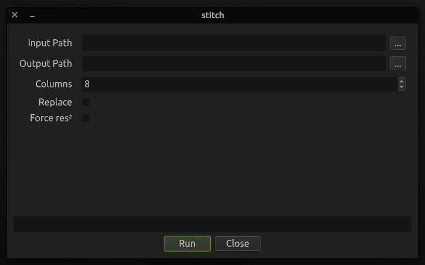
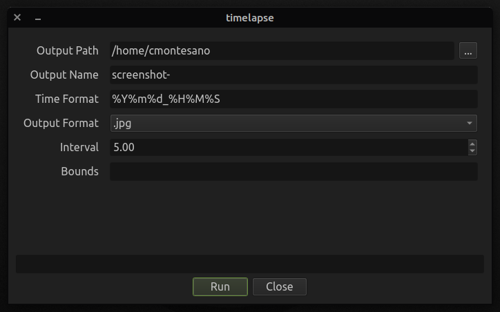

# xappt_plugins

This is a collection of various plugins for [xappt](https://github.com/cmontesano/xappt).

I am in the process of porting several plugins from a system that I wrote for myself some time ago. I will try to update this README with notes as plugins are ready.

# Running xappt/xappt_qt

I've provided a couple of Linux scripts to help get things set up. These live in `xappt_plugins/scripts`.

The basic idea is to install the python packages listed in [requirements.txt](https://github.com/cmontesano/xappt_plugins/blob/master/requirements.txt), set the `XAPPT_PLUGIN_PATH` environment variable, and then invoke `xappt-browser`, which will be installed as an external python script when installing `xappt_qt`.

The script [create_environment.sh](https://github.com/cmontesano/xappt_plugins/blob/master/scripts/create_environment.sh) will check for Python 3*, and the `pip` and `venv` modules. If all of this is satisfied a virtual environment will be created and the requirements will be installed.

<small>* Python 3.7+ is required for xappt, but the script only checks for `python3`</small>

The [run_xappt.sh](https://github.com/cmontesano/xappt_plugins/blob/master/scripts/run_xappt.sh) script assumes that a virtual environment with all of the requirements already exists at `xappt_plugins/venv`. 
This script will activate the virtual environment, set the `XAPPT_PLUGIN_PATH` environment variable, and launch the [xappt](https://github.com/cmontesano/xappt) interface provided by [xappt_qt](https://github.com/cmontesano/xappt_qt).

These scripts should work on OS X, but that's completely untested. And it should be fairly easy to create Windows equivalents. If someone wants to contribute those I'll be happy to include them.

# stitch
### xappt_plugins/plugins/image_manipulation/stitch_frames.py

This plugin will scan a folder for images and stitch matching images into a single image. I use this for assembling sprite sheets.

#### Parameters

- input_path
  - This is the folder containing the images to stitch. If multiple sequences exist in this folder they will be collected and processed individually. Currently PNG and JPEG files are supported. There is a folder full of test images in `xappt_plugins/test_data/frames_to_stitch`.
- output_path
  - This is where the stitched images will be saved. Each stitched image will be named with the word "\[stitched]" replacing the frame numbers. For example, the sequence `filename001.png`, `filename002.png`, `filename003.png` will be combined in an image named `filename[stitched].png`.
- columns
  - This is the number of images per row in the stitched image.
- replace
  - Set this to `True` to replace any existing stitched images. If False an error will be raised if a stitched file with the same name already exists in the output path.
- force_po2
  - When `True` this will force the stitched image's width and height to round up to a power of two. For example, if you are stitching 3 images all sized **256x256**, the output resolution would be **768x256**. That width is not a power of two, so when this parameter is `True` the image will be right/bottom padded with empty space to reach a resolution of **1024x256**.

# newproject
### xappt_plugins/plugins/godot/plugins/new_project.py

This plugin will create a new Godot project from a template with optional encryption, GDNative starter files, and build scripts. A simple JSON manifest will be created in the project's folder with some information that can be used by other some plugins.

#### Parameters

- project_name
  - This will be the title of the newly created project.
- project_path
  - This is the folder where the new project will be created.
- git
  - When `True` this will initialize a git repository in the project's folder. This assumes that `git` is available on your `PATH` environment variable.
- encryption
  - When `True` this will generate a unique encryption key and enable script encryption for the project. Note that you will have to build project templates in order to make use of encryption. I do have another plugin yet to be ported that will read the project manifest and generate those templates.
- godot_version
  - This plugin ships with a few templates for various Godot versions - currently all 3.2 stable releases, but this system is designed to allow adding custom templates with any number of files.
- gdnative
  - When `True` this will create sample GDNative C++ source files and build scripts to make it easy to compile. Currently these build scripts are for Linux only, and assume that `godot` and `scons` are on your `PATH` environment variable and that the necessary build requirements are satisfied.
- class_name
  - This is the class name that will be used in the example GDNative files. This is just to save you some renaming. The default is `GDExample`. The source files are pulled directly from the official Godot GDNative C++ documentation.

# timelapse
### xappt_plugins/plugins/image_manipulation/time_lapse.py

This plugin will take a screenshot at fixed user-defined intervals, with configurable image format and file naming.

#### Parameters

- output_path
  - This is the directory where the screenshots will be saved.
- output_name
  - This is the file name prefix for each screenshot.
- time_format
  - This is the date format, which must be compatible with [python's datetime module](https://docs.python.org/3/library/datetime.html#strftime-and-strptime-format-codes).
- output_format
  - Choose whether the screenshots will be JPEG or PNG images.
- interval
  - Specify the time to wait between each screenshot.
- bounds
  - This allows you to specify recording coordinates in the format x1,y1,x2,y2. Leave this blank to use the full screen.
